# Tugas Besar _Milestone_ 2 IF3110 - _Client SPA_

## Deskripsi Aplikasi
Ini adalah tampilan client untuk aplikasi kurir

## Tangkapan Layar Tampilan Aplikasi
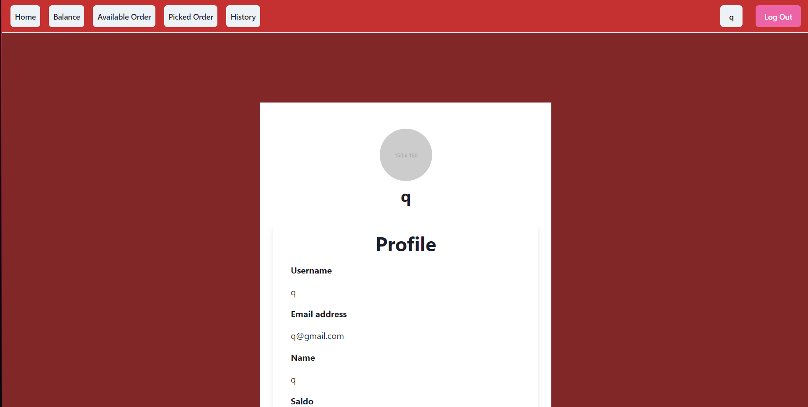
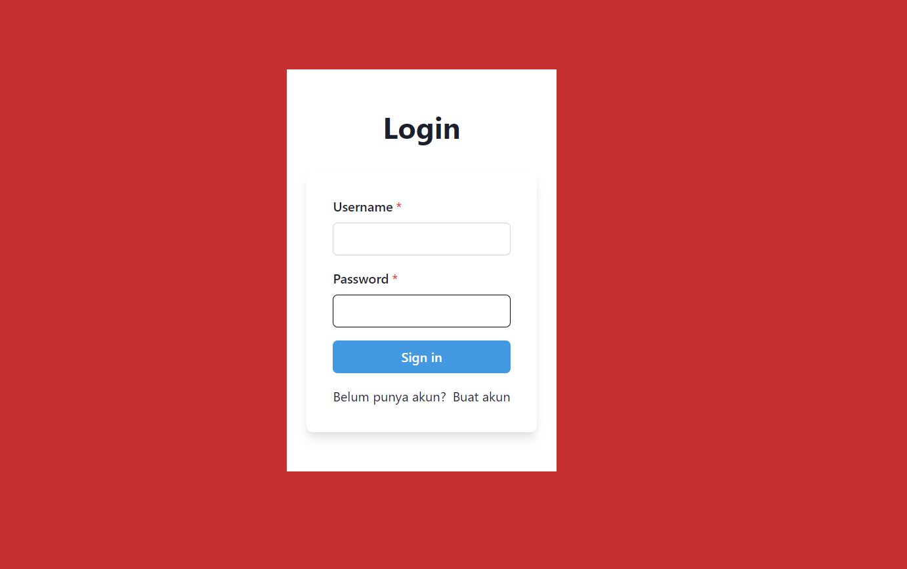
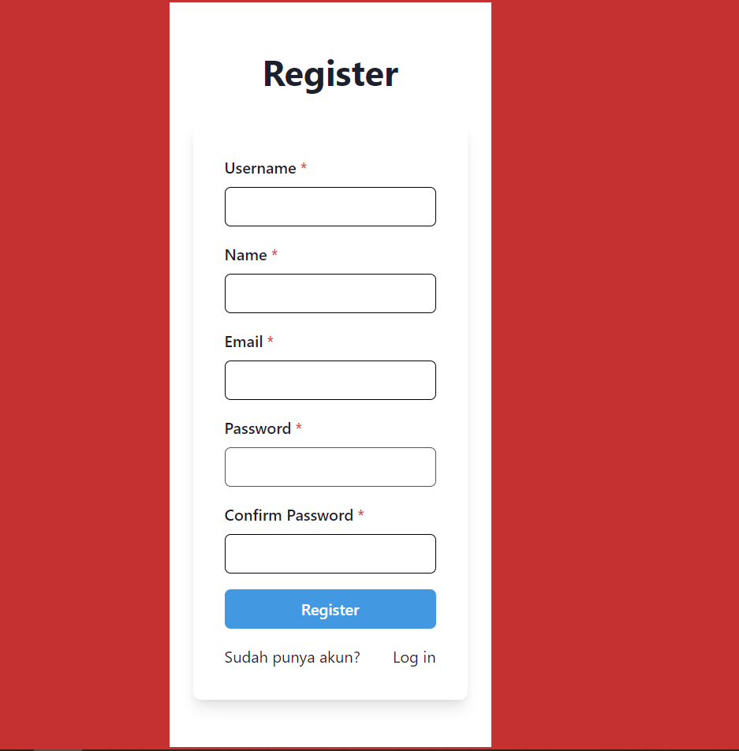
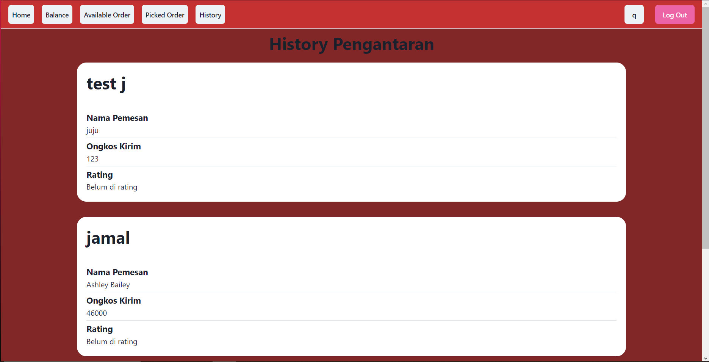
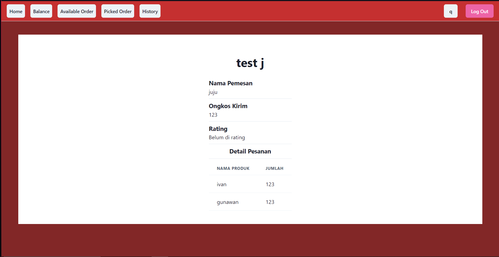
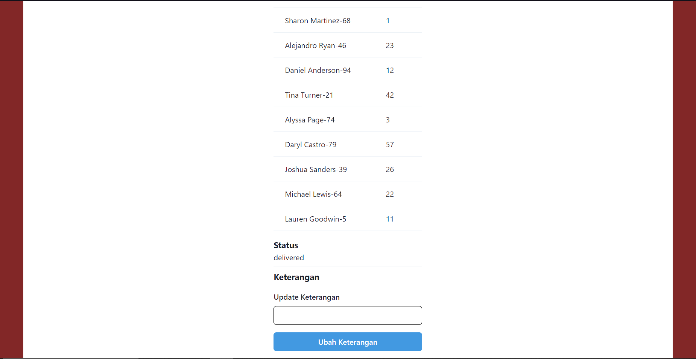
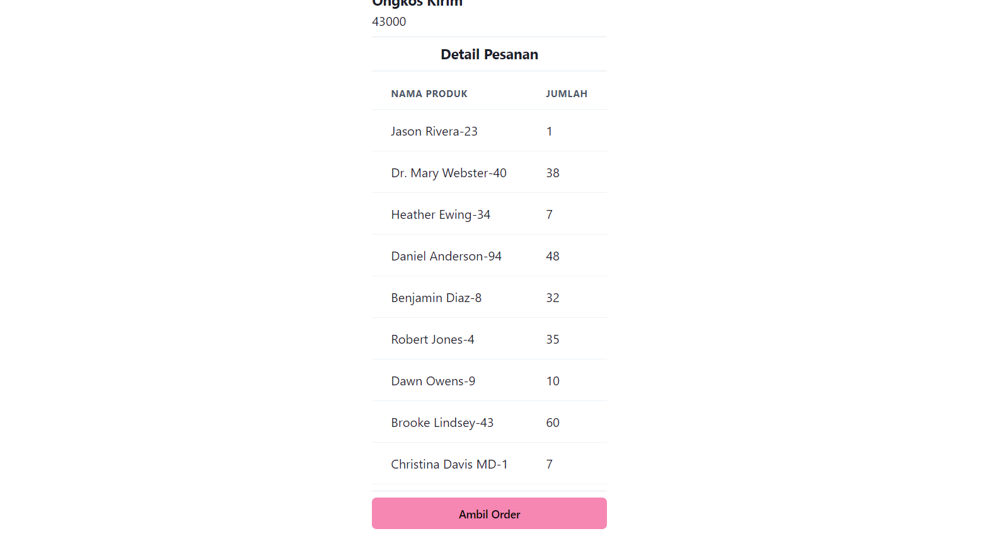
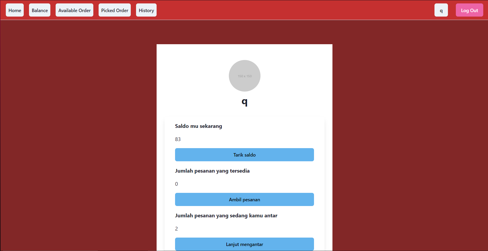
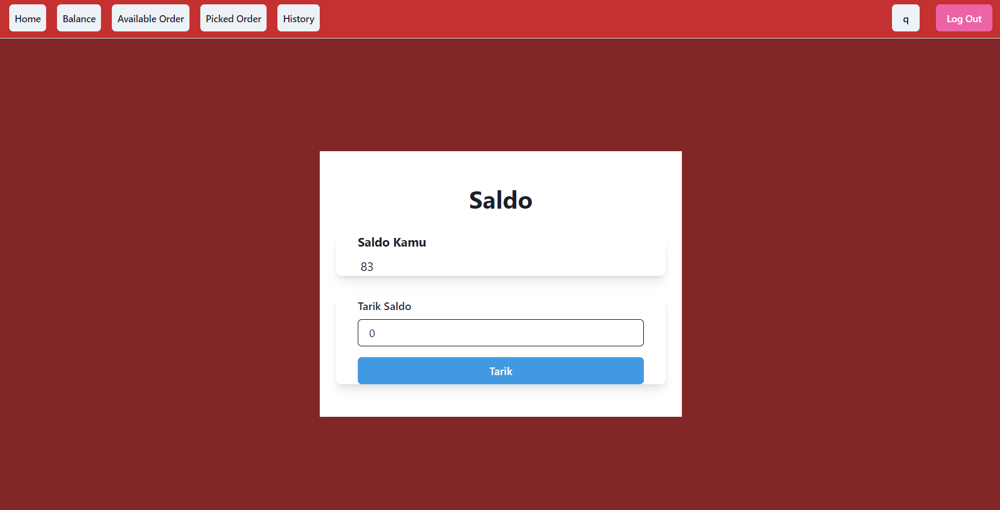
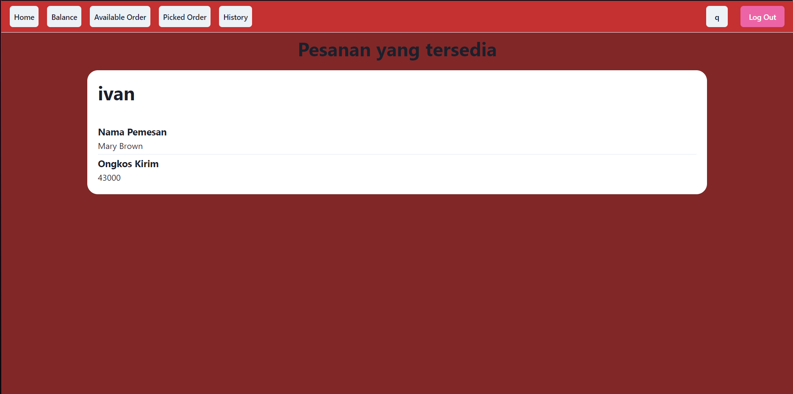
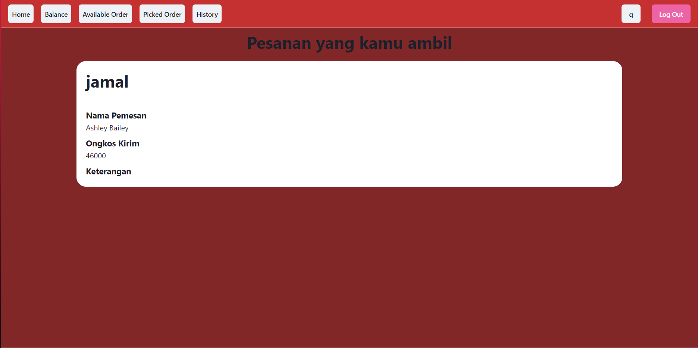

   
## Pembagian Tugas

### Anggota Kelompok
**Kelompok 36**
| Nama                         | NIM      |
|------------------------------|----------|
| Ulung Adi Putra              | 13521122 |
| Naufal Baldemar Ardanni      | 13521154 |
| Dewana Gustavus Haraka Otang | 13521173 |

### Client SPA

| Fungsionalitas                |           NIM                 |
|-------------------------------|-------------------------------|
| Homepage   |  13521173  |
| Saldo  |  13521173  |
| Pesanan Tersedia  |  13521173  |
| Pesanan Diambil  |  13521173  |
| Detail Pesanan  |  13521173  |
| History Pengantaran  |  13521173  |
| Login  |  13521173  |
| Register  |  13521173  |
| Integrasi Backend  |  13521173  |
| Setup  |  13521173  |
| Docker  |  13521173  |
| Profile  |  13521173  |
| Logo  |  13521154  |